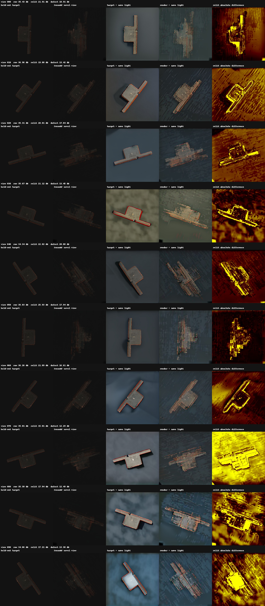

# Neural Gaffer × Real-IAD 缺陷检测实验记录

## 1. 项目目标

本阶段希望验证以下流程是否可行：

1. 从 Real-IAD 的一个三维样本中获得约 100 个视角；
2. 选取其中 80 个视角训练辐射场，剩余 20 个视角作为未见视角测试集；
3. 使用 Neural Gaffer 对图像重光照，使缺陷更清晰；
4. 合成测试视角，并与同视角真实图像比较，用于缺陷检测；
5. 将最终图像分辨率由原始的 256×256 提升到 512×512，同时尽量保留细小缺陷。

实验最终确认：代码中的各个模块都可以运行，但当前 Real-IAD D3 数据并不具备完成上述“真实多视角重建”所需的独立多视角观测。因此，目前生成的 100 张图只能用于流程调试，不能证明模型能够从 80 个真实视角恢复另外 20 个真实视角。

---

## 2. 环境与基础代码准备

项目目录：

```text
/home/lcwt/cxy/Neural_Gaffer-main
```

使用的 Conda 环境：

```text
/home/lcwt/cxy/.conda/envs/neural-gaffer
```

主要完成了以下工作：

- 安装并调整 Neural Gaffer 所需的 PyTorch、TorchVision、xFormers、Diffusers、Transformers 等依赖；
- 下载 Zero123-XL 相关组件和 Neural Gaffer 官方检查点；
- 解决 Hugging Face 登录及模型下载问题；
- 成功运行 Neural Gaffer 原始的 256×256 推理流程；
- 检查并运行仓库自带的三维重光照/TensoRF 代码。

原始 Neural Gaffer 模型是在 256×256 分辨率下训练的。直接将扩散模型推理尺寸强制修改为 512×512，会产生明显的分布偏移，因此后续没有继续采用简单放大输入尺寸的方案。

---

## 3. 使用的数据

本次选择的 Real-IAD 类别和样本为：

```text
类别：fuse_holder
缺陷：impact_damage
样本：S0001
```

该样本包含：

- 一份 PCD 点云；
- 一份 XYZ TIFF；
- 一组伪三维/光度立体数据；
- 5 张固定相机、不同照明条件下的 RGB 图像（RGBL01～RGBL05）。

### 关键结论

Real-IAD D3 中的“三维”主要指 RGB、光度立体和高精度点云等多模态数据，并不表示同一个样本具有 80 或 100 个独立相机视角。

当前 `S0001` 实际上只有一个顶部扫描视角。`S0002` 等编号对应不同的物理样本，不能作为 `S0001` 的其他相机视角使用。

因此，实验中使用的 100 张环绕图，是把同一份 XYZ/PCD 点云投影到 100 个虚拟相机位姿得到的，不是重新采集的 100 份独立三维信息。其局限包括：

- 物体侧面和背面没有真实纹理及几何；
- 遮挡区域无法从单视角点云中恢复；
- 点云投影、z-buffer 和空洞填充会产生条纹、重影和缺失；
- 增加虚拟相机数量只会增加投影图数量，不会增加新的观测信息。

100 张虚拟视图由以下脚本生成：

```text
/home/lcwt/cxy/real_iad_experiments/render_pcd_views.py
```

输出目录：

```text
/home/lcwt/cxy/real_iad_experiments/outputs/fuse_holder_impact_S0001_pseudo3d_textured_views
```

生成设置为 512×512、环绕一周、相邻视角间隔约 3.6°，同时保存了前景掩码、相机位姿和接触表。

---

## 4. 512×512 重光照实验

### 4.1 直接将 Neural Gaffer 微调到 512×512

首先尝试了直接 512×512 推理和 LoRA 微调，希望让模型适应更高分辨率并避免抹平微小缺陷。

主要代码位于：

```text
/home/lcwt/cxy/Neural_Gaffer-main/real_iad_finetune_512
```

其中包括数据清单、LoRA 训练、推理和评估脚本。

部分结果如下：

| 模型 | PSNR | 缺陷区域 PSNR | 光照响应 |
|---|---:|---:|---:|
| 直接 512 基线 | 22.992 | 19.416 | 6.152 |
| LoRA step 50 | 22.770 | 19.132 | 7.212 |
| LoRA step 100 | 22.613 | 18.917 | 8.100 |

LoRA 增强了输出对光照条件的响应，但整体保真度和缺陷区域指标持续下降。原因是原模型的训练分辨率和特征尺度均基于 256×256，仅靠少量 LoRA 参数无法可靠地把整个扩散模型迁移到 512×512。

结论：**直接把 Neural Gaffer 改成 512×512 的方案不适合作为当前主方案。**

### 4.2 两阶段 512×512 细节恢复

随后采用了更稳定的两阶段方案：

1. Neural Gaffer 仍在原生 256×256 下完成重光照；
2. 将粗重光照结果放大至 512×512；
3. 从原始 512 图像中提取高频结构；
4. 使用轻量级 `DetailRefiner` 融合原图细节和重光照结果。

`DetailRefiner` 约有 33.8 万个参数，训练损失包含：

- 前景/缺陷加权的像素重建损失；
- Sobel 边缘损失；
- 高频细节保持约束；
- 后期加入的伪输出蒸馏及联合正则化。

使用 Real-IAD 五种真实照明图像构建了约 8,800 个训练配对和 2,200 个验证配对。

真实照明配对上的结果：

| 方法 | 整体 PSNR | 缺陷区域 PSNR |
|---|---:|---:|
| 粗重光照结果 | 35.499 | 32.142 |
| 固定高频融合 | 36.873 | 33.033 |
| DetailRefiner step 300 | 39.271 | 34.507 |

对应检查点：

```text
/home/lcwt/cxy/Neural_Gaffer-main/real_iad_finetune_512/detail_refiner_v1/run_300/step-000300.pt
```

由于真实五灯配对和任意环境光之间存在域差异，又训练了带联合正则化的版本。最终选用的检查点为：

```text
/home/lcwt/cxy/Neural_Gaffer-main/real_iad_finetune_512/detail_refiner_v1/joint_regularized/run_200/step-000200.pt
```

其结果为：

| 测试场景 | 整体 PSNR | 缺陷区域 PSNR | 光照响应 |
|---|---:|---:|---:|
| 真实配对验证 | 38.077 | 34.108 | — |
| 任意环境光端到端 | 25.753 | 22.113 | 12.405 |

作为对比：

| 方法 | 整体 PSNR | 缺陷区域 PSNR |
|---|---:|---:|
| 原生 256 粗结果 | 25.239 | 21.840 |
| 直接 512 基线 | 22.992 | 19.416 |
| 固定高频融合 | 25.804 | 22.153 |
| 联合正则 DetailRefiner | 25.753 | 22.113 |

结论：两阶段方法明显优于直接 512 扩散，但它主要解决的是“单张图像放大并保留细节”，不能自动解决不同视角之间的三维一致性问题。

---

## 5. 环境光与 100 张重光照图像

实验使用了 LDR/HDR 环境图，并按角度旋转环境光。环境图处理结果主要保存在：

```text
/home/lcwt/cxy/Neural_Gaffer-main/real_iad_env_sweep/lighting_official_hdr_36/012_hdrmaps_com_free_2K
```

实验按约 10° 间隔改变环境光方向，并考虑了相机方位与环境图旋转方向的对应关系。

100 张 512×512 重光照图像保存在：

```text
/home/lcwt/cxy/real_iad_experiments/outputs/fuse_holder_impact_S0001_relight512_100
```

数据被划分为：

- 80 张训练图；
- 20 张测试图；
- 每隔 5 张抽取一张作为测试视角；
- 训练集和测试集没有索引重叠。

统计结果：

- 平均重光照变化约为 53.242 个灰度级；
- 缺陷区域拉普拉斯细节保持率约为 0.7346。

虽然单张图中能观察到光照变化，但不同视角是分别通过扩散模型生成的。模型会分别生成背景、阴影、反光和局部纹理，因此这些图像并不严格对应同一个静态三维场景。这成为后续辐射场训练失败的主要原因之一。

---

## 6. TensoRF 辐射场实验

### 6.1 仓库中原有的三维代码

Neural Gaffer 仓库本身确实包含论文使用的三维重光照代码：

```text
/home/lcwt/cxy/Neural_Gaffer-main/neural_gaffer_3d_relighting
```

相关原始文件包括：

```text
dataLoader/Gaffer_3D_TensoRF.py
dataLoader/Gaffer_3D_Relighting.py
train.py
models/
```

其基本思路是：输入同一静态物体的多张已标定真实视角图像，使用 TensoRF 建立辐射场，再在新视角或新光照下进行渲染。

它需要的关键输入是真实多视角图像和对应的相机内外参。代码可以利用已有的多视角数据构建辐射场，但不能从单张顶部点云中凭空产生缺失的侧面和背面信息。

### 6.2 对代码所做的适配

为读取本次 Real-IAD 实验数据，增加或修改了以下内容：

```text
neural_gaffer_3d_relighting/dataLoader/RealIAD_Cascade.py
neural_gaffer_3d_relighting/dataLoader/__init__.py
neural_gaffer_3d_relighting/configs/realiad_cascade_tensorf_1000.txt
neural_gaffer_3d_relighting/configs/realiad_unrelit_tensorf_15000.txt
neural_gaffer_3d_relighting/prepare_realiad_debug_split.py
neural_gaffer_3d_relighting/evaluate_realiad_test.py
neural_gaffer_3d_relighting/train.py
```

适配内容包括：

- 读取 `transforms_train.json` 和 `transforms_test.json`；
- 根据 OpenGL/Blender 相机约定生成射线；
- 归一化相机轨道半径；
- 使用前景掩码和缺陷区域计算额外指标；
- 生成测试视角对比图；
- 关闭不必要的可选 LPIPS 诊断，减少评估依赖。

使用的核心模型为 `TensorVMSplit`：它通过低秩张量分解表示密度场和外观特征，再用小型 MLP 解码颜色并进行体渲染。

较完整的训练设置为：

- 训练 15,000 步；
- 初始体素分辨率约 128³；
- 逐步增加到约 2,700 万体素；
- 在 2,000、3,000、4,000、5,500、7,000 步进行上采样；
- 在 2,000 和 4,000 步更新 alpha mask。

---

## 7. 辐射场实验结果

### 7.1 错误流程：先分别重光照，再训练 TensoRF

最初使用 80 张已经分别重光照的图训练 TensoRF，再合成 20 张测试视角。

输出目录：

```text
/home/lcwt/cxy/real_iad_experiments/radiance_field/fuse_holder_impact_S0001_80train_20test
```

结果：

| 指标 | 数值 |
|---|---:|
| 测试集整体 PSNR | 约 20.68 dB |
| 缺陷区域 PSNR | 约 16.35 dB |

视觉结果严重模糊并伴随重影，无法用于细小缺陷检测。进一步训练后，训练视角也只能达到约 27.00 dB，缺陷区域约 17.95 dB。

原因是不同视角经过独立扩散重光照后，已经不再满足静态辐射场假设。TensoRF 会把不一致的阴影、纹理和背景平均到一起，从而产生模糊和重影。

### 7.2 原始未重光照数据的过拟合检查

为了排除相机射线或 TensoRF 实现错误，又进行了两个最小过拟合实验。

| 实验 | 整体 PSNR | 缺陷区域 PSNR |
|---|---:|---:|
| 单张原始视图，同视角训练/测试 | 41.211 | 28.300 |
| 8 张原始环绕图，同视角训练/测试 | 41.049 | 28.347 |

输出目录：

```text
/home/lcwt/cxy/real_iad_experiments/debug/radiance_field/overfit_unrelit_view040
/home/lcwt/cxy/real_iad_experiments/debug/radiance_field/overfit_unrelit_8views
```

这说明：

- 数据加载和射线方向基本可用；
- TensoRF 可以记忆训练图像；
- 前面的严重失败不是单纯由代码无法训练造成的。

但同视角过拟合只证明模型能记住输入，不代表它获得了完整、正确的三维几何。

### 7.3 修正流程：先训练未重光照辐射场，再进行重光照

随后把顺序改为：

```text
原始伪多视角 → 80 张训练 TensoRF → 合成 20 张未见视角 → 对结果重光照
```

训练数据：

```text
/home/lcwt/cxy/real_iad_experiments/outputs/fuse_holder_impact_S0001_unrelit_80train_20test
```

15,000 步结果：

```text
/home/lcwt/cxy/real_iad_experiments/radiance_field_corrected/fuse_holder_impact_S0001_unrelit_80train_20test
```

| 指标 | 数值 |
|---|---:|
| TensoRF 报告的测试 PSNR | 35.626 dB |
| 自定义整体 PSNR | 35.532 dB |
| 缺陷区域 PSNR | 26.374 dB |

数值相较前一流程大幅提高，但用户查看接触表后仍能明显看到模糊和重影，尤其是物体轮廓和细小缺陷。

高 PSNR 与视觉效果不一致的主要原因是：物体只占整张图约 9%，大面积黑色背景很容易被模型正确预测，导致全图 PSNR 被背景显著抬高。因此，35 dB 并不表示缺陷区域已经清晰重建。




### 7.4 同一环境光下的配对重光照测试

为了避免比较双方使用不同光源，对真实目标图和 TensoRF 合成图采用了同一环境图、同一旋转角度和同一随机种子。

使用脚本：

```text
/home/lcwt/cxy/Neural_Gaffer-main/real_iad_finetune_512/relight_tensorf_pairs.py
```

输出目录：

```text
/home/lcwt/cxy/real_iad_experiments/corrected_pipeline/fuse_holder_impact_S0001_20views_same_light
```

| 阶段 | 整体 PSNR | 缺陷区域 PSNR |
|---|---:|---:|
| 重光照前 | 35.532 | 26.374 |
| 分别通过 Neural Gaffer 重光照后 | 20.194 | 15.769 |

即使显式使用相同光源，两个略有差异的输入分别经过扩散模型时，也会生成不同的纹理、背景、反光和阴影。输入误差被进一步放大，因此不能把两个独立的 Neural Gaffer 输出直接做像素差来定位缺陷。

---

## 8. 当前总体结论

### 已经跑通的部分

- Neural Gaffer 原始 256×256 推理；
- HDR/LDR 环境图旋转和多角度光照生成；
- Real-IAD 点云/XYZ 的虚拟视角渲染；
- 80/20 训练测试划分；
- 两阶段 512×512 细节恢复；
- Real-IAD 到 TensoRF 的数据加载、训练和评估；
- 同光源的目标图/合成图配对重光照；
- 前景和缺陷区域的定量评估及接触表生成。

### 当前不能满足要求的部分

- 100 张虚拟图不是 100 个真实相机观测；
- 单个顶部点云无法提供完整的侧面、背面和遮挡区域信息；
- TensoRF 对当前伪多视角数据的测试视角仍有模糊和重影；
- 独立逐图扩散重光照破坏多视角一致性；
- 全图 PSNR 被大面积背景主导，不能可靠表示缺陷清晰度；
- 当前结果还不能作为可靠的细粒度缺陷检测基线。

因此，问题并不是简单的“80 张图数量不够”。即使把相同点云渲染为 200 或 1,000 张图，也不会增加被遮挡表面的真实信息。核心问题是观测源只有一份，而且生成图中存在视角相关的投影伪影。

---

## 9. 后续改进建议

### 方案 A：按照 Real-IAD D3 的原生特点做缺陷检测

这是当前最稳妥、最容易形成有效结果的方向。

建议流程：

```text
RGBL01～05 + XYZ/PCD + 光度立体法线
    → 多模态对齐
    → 只使用正常样本训练
    → RGB/深度/法线特征融合
    → 异常分数和缺陷掩码
```

Neural Gaffer 可以作为正常样本的光照增强工具，但不应把其生成结果当成严格配准的像素级真值。

可尝试的模型包括 PatchCore、EfficientAD、Reverse Distillation，或者基于 RGB 与 3D 特征融合的异常检测模型。

### 方案 B：如果必须完成真实的“80 视角训练、20 视角测试”

需要更换数据或重新采集同一个物体的真实多视角数据：

- 使用转台或多相机拍摄同一个物体；
- 每个角度都需要独立 RGB 图像；
- 标定相机内参和外参，或使用 COLMAP 求解；
- 固定曝光、白平衡及物体位置；
- 保留前景掩码、深度和法线；
- 按相机视角划分训练集和测试集。

在这种数据上，仓库原有的 `neural_gaffer_3d_relighting` 才能真正发挥作用。

推荐流程为：

```text
真实标定多视角
    → 前景分割与相机位姿校验
    → 3DGS/NeRF 重建
    → 未见视角渲染
    → 在三维表示中施加共享光照
    → 同视角缺陷检测与评估
```

### 方案 C：继续改进三维重建算法

如果仍要利用现有点云，可把 TensoRF 替换或扩展为：

- 使用 PCD/XYZ 初始化的 3D Gaussian Splatting；
- 加入深度监督和法线监督；
- 训练时提高物体和缺陷区域射线采样比例，例如 70% 前景、30% 背景；
- 裁剪物体区域并同步修正相机内参，避免背景主导损失；
- 加入边缘、高频和局部 patch 损失；
- 使用更高分辨率的多尺度训练；
- 将评价指标改为前景 PSNR、前景 SSIM、LPIPS、边界误差和缺陷召回率。

这些方法可能减轻模糊，但无法恢复当前数据中从未被观测到的侧面和背面内容。

### 方案 D：改进重光照的一致性

不建议继续对每个视角独立调用扩散模型后再训练辐射场。更合理的方向是：

- 先用真实多视角数据建立统一三维表示，再进行三维重光照；
- 为所有视角共享同一个光照 latent 或环境图条件；
- 使用可重光照 NeRF/3DGS，显式分离几何、材质和光照；
- 若继续使用 Neural Gaffer，只将其用于视觉增强或数据扩增，不直接对两次独立生成结果做像素差。

---

## 10. 推荐的下一步

当前最值得优先做的是以下二选一：

1. **以缺陷检测为主要目标：**停止使用伪 100 视角，直接基于 Real-IAD 的 RGB、点云、XYZ 和法线建立多模态异常检测基线；
2. **以新视角重建为主要目标：**换用或采集真正的标定多视角数据，然后重新训练 3DGS/TensoRF，并在统一三维场景中进行重光照。

如果继续沿用当前 `S0001` 的单视角点云，后续优化可以改善画面，但不能从根本上解决未见视角重影和细节缺失问题。

