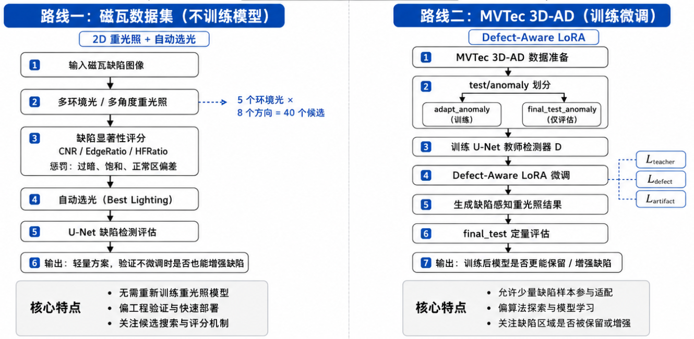
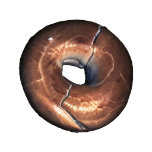
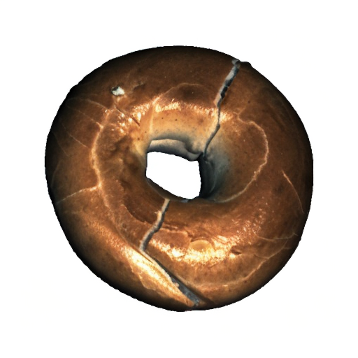
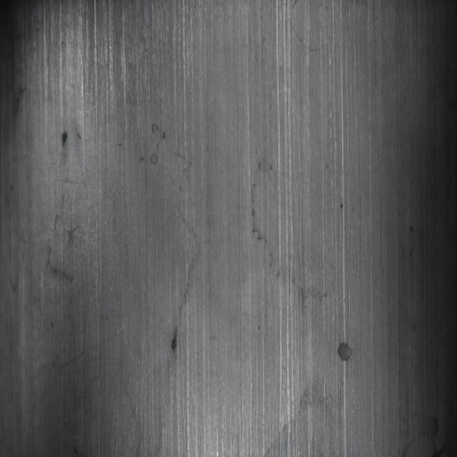
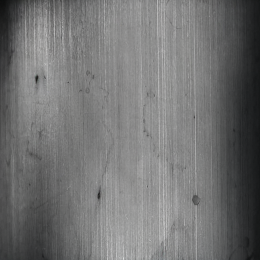

# Neural Gaffer 缺陷感知重光照项目阶段性工作总结（7月5日—7月7日）

## 1. 项目背景与总体思路

Neural Gaffer 原始模型基于 Zero123-XL 框架实现 3D 物体重光照，默认输入输出分辨率为 256×256。对于普通物体重光照任务而言，256 分辨率可以满足整体光照变化和外观重建需求；但在工业缺陷检测场景中，缺陷往往表现为细小划痕、裂纹、凹坑、污染、局部纹理异常或边缘破损，这些区域尺度小、对比度弱，容易在生成式重光照过程中被平滑、模糊甚至抹除。

因此，本项目的核心目标并不是简单地让图像“变亮”或“更好看”，而是探索 **重光照是否能够提高工业缺陷的可见性，并进一步提升下游缺陷检测性能**。围绕这一目标，目前形成了两条并行技术路线：

根据数据集的特点，形成了两条并行技术路线：
1. **路线一：不训练微调，直接做 2D 重光照与自动选光**  
   代表实验是磁瓦缺陷数据集。该数据集只有2d的图像，没有3d点云。因此没办法去训练重光照模型。该路线而是利用已有 512 LoRA 推理能力，对每张缺陷图像生成多个不同光照候选，再通过缺陷显著性评分自动选择最有利于检测的光照结果。该路线更偏工程验证，重点是看“仅靠重光照候选生成 + 自动选光”能不能增强缺陷。（但这个转换实在是太慢了。。。转一张图就要很久，还在转换中，可能需要几天）

2. **路线二：进行缺陷感知微调，训练 defect-aware LoRA**  
   代表实验是 MVTec 3D-AD 数据集。该数据集分为训练集和测试集两个部分，但是训练集只包含正常样本，不包含缺陷样本。因此如果只把训练集用于重光照模型训练，大概率会出现在test数据集上重光照时，会把缺陷抹除掉的问题。因此我的想法是利用一部分 test anomaly 作为 adaptation 数据，在 512 LoRA 基础上继续微调，使模型在重光照时尽量保留甚至增强缺陷区域。该路线更偏算法探索，重点是看“缺陷样本参与训练后，重光照模型能否学到 defect-aware 的生成倾向”。

---

## 2. 主要工作

### 2.1 512 LoRA 改动梳理

在 512 分辨率适配阶段，我主要完成了模型输入输出尺寸、光照条件输入和轻量化微调方式的统一调整。具体来说，将原本 256×256 的重光照流程提升到 512×512，并同步修改了图像预处理、特征尺寸和推理输出，使训练和测试过程保持一致。为了让模型在高分辨率下更好地利用图像信息和环境光照信息，对网络输入结构进行了扩展，使其能够同时接收原始图像、环境光条件和辅助光照信息。微调方式上采用 LoRA，只更新少量新增参数，主干模型保持冻结，从而降低训练成本并减少模型不稳定的风险。权重初始化时，先继承原有 Neural Gaffer 基础模型的重光照能力，再在 512 分辨率数据上进行适配训练。与此同时，还修复了推理过程中的精度、权重匹配和环境光尺寸对齐等问题，保证模型能够稳定运行。需要说明的是，本阶段并没有重新设计 VAE，而是在原有编码结构基础上完成分辨率升级。实验表明，512 LoRA 模型已经能够较好适配 MVTec 3D-AD 图像，说明该模型既可以作为磁瓦路线中的固定重光照工具，也可以作为后续缺陷感知 LoRA 微调的基础模型。

  

### 2.2 路线一：不微调模型的 2D 重光照与自动选光

路线一主要面向磁瓦缺陷数据集，核心思想是：**不改变模型参数，直接利用已有 512 LoRA 模型生成不同光照下的图像，然后从多个候选结果中选择最有利于缺陷检测的图像**。

这条路线的出发点是工程上更直接的问题：在实际工业检测中，很多时候并不一定有足够的数据或算力去重新训练生成模型。如果已有重光照模型可以直接使用，那么可以先尝试通过“多光照候选生成 + 自动选光”的方式改善缺陷可见性。也就是说，这条路线更像是一个光照搜索与图像增强问题。

它需要回答的问题包括：

1. 不进行 defect-aware LoRA 微调，仅靠已有重光照模型，能否产生对缺陷更友好的光照结果？
2. 多角度、多环境光生成的候选图像中，是否存在明显优于原图的检测视角？
3. 缺陷显著性评分是否能够自动选出更适合下游检测的图像？
4. 这种方法在磁瓦这类 2D 工业表面缺陷图像上是否有效？

针对磁瓦缺陷数据集，创建 `run_magnetic_tile_relight_experiment.py`。该脚本按照“不微调模型、直接重光照选光”的思路设计，包含 7 个阶段：

1. 数据集扫描；
2. 环境光加载；
3. Neural Gaffer / LoRA pipeline 构建；
4. 重光照推理与缺陷显著性评分；
5. 自动选光；
6. U-Net 缺陷检测模型训练；
7. 最终检测效果评估。

磁瓦数据集共处理 1344 张图像，每张图像生成 8 个不同光照结果，总计约 10752 次推理。这里的重点不是训练重光照模型，而是把已有重光照模型当作一种图像增强器，观察在不同光照条件下缺陷检测表现是否发生变化。
实验过程中还修复了小样本划分 bug：当某些类别样本数小于 3 时，分层划分会报错，因此增加了对小样本类别的兼容逻辑。同时，为了避免长时间推理过程中因后续 U-Net 训练失败而丢失中间结果，增加了中间结果保存机制：重光照图片先写入磁盘，再执行后续自动选光和训练流程。
目前磁瓦实验已经保存 600多个样本的重光照结果，剩余还在跑。
    

### 2.3 缺陷显著性评分体系

为了从多个重光照候选中自动选择最有利于缺陷检测的结果，本阶段设计了缺陷显著性评分体系。评分由 3 个正向指标和 3 个惩罚项组成。

正向指标包括：

1. **CNR（Contrast-to-Noise Ratio）**：衡量缺陷区域与背景区域之间的对比度差异；
2. **EdgeRatio**：衡量缺陷区域边缘强度是否增强；
3. **HFRatio**：衡量缺陷区域高频纹理信息是否更加明显。

惩罚项包括：

1. 饱和区域比例过高；
2. 图像整体或局部过暗；
3. 正常区域与原图的 L1 偏差过大。

这一评分体系体现了路线一的核心思想：重光照不能只追求缺陷更亮或边缘更强，还必须避免引入过曝、欠曝和正常区域伪影。如果某个光照虽然增强了缺陷，但同时严重改变了正常区域纹理，那么它可能会误导下游缺陷检测模型。因此，自动选光本质上是一个多目标平衡问题：既要增强异常区域，又要约束正常区域稳定性。

大概就是`Score = w1*CNR + w2*EdgeRatio + w3*HFRatio - penalties`

---

### 2.4. 路线二：MVTec 3D-AD 上的 Defect-Aware LoRA 微调

路线二主要面向 MVTec 3D-AD 数据集，核心思想是：**利用少量缺陷样本参与 LoRA 微调，使重光照模型在生成过程中主动保留或增强缺陷区域**。

这条路线与磁瓦路线不同。磁瓦路线不训练模型，只是在已有模型输出中进行自动选光；而 MVTec 3D-AD 路线允许模型参数发生变化，目标是训练一个 defect-aware relighting LoRA。它要解决的问题是：普通重光照模型可能会把缺陷当作噪声或局部纹理误差进行平滑，而 defect-aware LoRA 应当学会在保持整体光照自然的同时，不削弱缺陷区域。

这条路线需要回答的问题包括：

1. 在 MVTec 3D-AD 这种 train 只有 normal、test 才有 anomaly 的数据结构下，如何合理构建 defect-aware 微调协议？
2. 如何避免把 final test 中的缺陷样本泄漏到训练阶段？
3. 如何设计损失函数，使模型既不偏离 512 LoRA teacher，又能保留缺陷区域？
4. 如何避免生成式 LoRA 微调过程中出现图像发黑、伪影和训练崩坏？

在 MVTec 3D-AD 路线中，我采用的是基于 512 LoRA 的二阶段缺陷感知微调方法。第一阶段的 512 LoRA 主要用于将 Neural Gaffer 从原始 256 分辨率适配到 512 分辨率，使模型具备稳定的高分辨率重光照能力；第二阶段则在此基础上继续训练 defect-aware LoRA，使模型在重光照过程中更加关注缺陷区域的保留与增强。

需要说明的是，U-Net 缺陷分割模型并不是直接接入 Neural Gaffer 的生成网络中，也不是推理阶段必须使用的模块。它主要作为训练阶段的辅助监督分支，用于提供缺陷区域的位置引导。具体来说，输入图像经过 Neural Gaffer 和当前 LoRA 后得到重光照结果，随后利用缺陷标注或检测器得到缺陷区域信息，并据此计算缺陷相关损失。反向传播时，只更新 LoRA 参数，而 Neural Gaffer 主干保持冻结。

在损失设计上，微调过程主要平衡三类目标：一是整体一致性约束，使 defect-aware LoRA 的输出不要过度偏离原 512 LoRA 的稳定重光照结果；二是缺陷区域约束，使损失重点作用在缺陷位置，鼓励模型保留缺陷边缘、高频纹理和局部对比度；三是图像质量约束，用于抑制过暗、过曝和正常区域伪影。因此，defect-aware LoRA 的目的不是让整张图像发生大幅变化，而是在保持整体光照自然和正常区域稳定的前提下，使缺陷区域在重光照后仍然清晰可见，甚至更有利于下游检测。

## 3. 后续工作计划

### 3.1 路线一：磁瓦数据集继续完成 2D 重光照自动选光

### 3.2 路线二：完成 MVTec 3D-AD 500 步训练并运行 eval 再将该模型运用于剩下的测试集数据集上重光照，用指标进行评价

