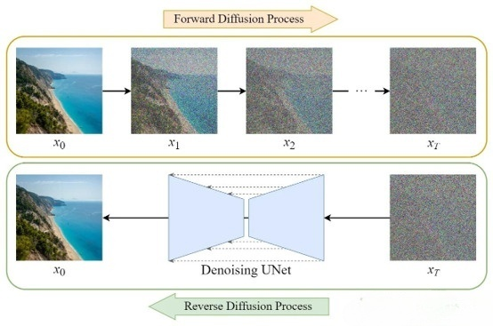
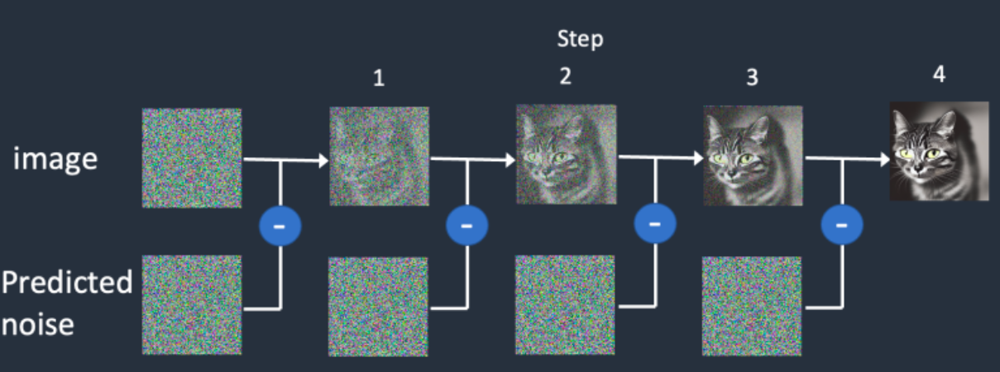
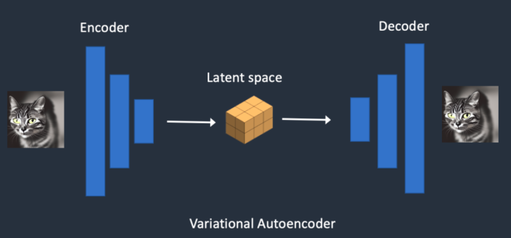
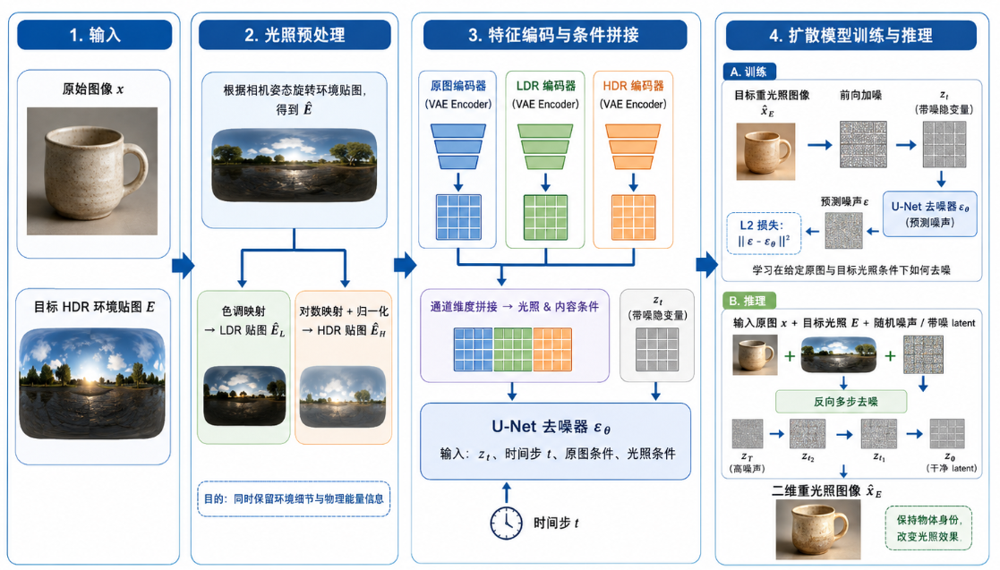

# Neural Gaffer 论文总结

## （一）模型整体定位

提出 Neural Gaffer，一套二维扩散重光照模型+两阶段 NeRF
三维重光照流水线。

核心目标：输入单张物体图像+目标 HDR 环境光照，实现物理真实、细节丰富的图像/三维模型重光照；解决传统方案（纯SDS、单一LDR/HDR输入）存在的过曝、细节丢失、光照错乱等问题。

**整体链路：** 2D 重光照扩散模型（基础模块）→ 引导 3D NeRF 重光照（拓展应用）

## （二）扩散模型基础原理：从加噪到条件去噪

Neural Gaffer的核心底座是潜在扩散模型，因此在理解其重光照方法之前，需要先理解扩散模型的基本工作方式。扩散模型可以简单理解为一种“先破坏、再恢复”的生成模型：训练时，模型不断把干净图像加上高斯噪声，使图像逐渐变成随机噪声；生成时，模型则从随机噪声出发，逐步去除噪声，最终恢复出符合条件的清晰图像。

1.  前向扩散：把清晰图像逐步加噪

在训练阶段，首先从数据集中选取一张真实图像，然后随机选择一个时间步
t，并按照该时间步对应的噪声强度向图像中加入高斯噪声。

2.  反向扩散：让U-Net学会逐步去噪

扩散模型真正需要学习的是反向过程，也就是如何从带噪图像一步步恢复出干净图像。在Stable Diffusion一类模型中，核心网络通常是U-Net。U-Net的任务不是直接预测最终图像，而是预测当前带噪图像中包含的噪声。训练时，**系统知道真实加入的噪声，因此可以让
U-Net 输出预测噪声，**并用二者之间的误差作为损失函数

3.  为什么预测噪声就能生成图像？

扩散模型的关键思想在于：如果模型能够在每一个时间步准确预测噪声，那么就可以把随机噪声一步步还原成有意义的图像。生成阶段并没有真实图像作为答案，而是先随机采样一个噪声隐变量，然后反复调用U-Net预测噪声，并由调度器根据预测结果更新当前隐变量。经过多步迭代后，噪声成分不断减少，图像结构、纹理和语义信息逐渐出现，最终解码得到清晰图像。

4.  为什么要在latent 隐空间中扩散？

如果直接在像素空间中对高分辨率图像反复加噪和去噪，计算量会非常大。Stable Diffusion 的改进之处在于先使用VAE编码器把图像压缩到低维 latent 隐空间，再在隐空间中进行扩散和去噪，最后用VAE解码器还原为像素图像。这样可以显著降低显存占用和计算复杂度，同时保留较强的图像生成能力。

5.  条件扩散：让模型按指定要求生成

扩散模型并不是只能随机生成图像，还可以加入条件信息来控制生成结果。普通文生图模型使用文本作为条件，图生图模型使用输入图像作为条件，而Neural Gaffer则进一步把“输入物体图像”和“目标环境光照”同时作为条件。这样，U-Net 在每一步去噪时都不是盲目生成，而是在回答一个更具体的问题：**如何在保留原物体身份的前提下，按照目标HDR环境光生成新的光照外观。**

因此，Neural Gaffer的重光照过程本质上可以理解为一种条件扩散生成过程：输入图像提供物体的形状、纹理和身份信息，目标环境贴图提供光照方向、颜色和强度信息，U-Net 在latent空间中逐步去噪，最终生成该物体在新光照条件下的图像。

## （三）模块一：二维重光照扩散模型（3.2 章节，核心底座）

### 1. 模型改造思路

基于潜在扩散模型微调，核心创新为HDR-LDR双分支光照条件+环境贴图坐标系对齐。

### 2. 完整工作流程

1.  光照预处理

输入目标 HDR 环境贴图E：

- 步骤 1：根据相机姿态旋转贴图，对齐相机坐标系，得到 $\widehat{E}$

- 步骤 2：分支1（色调映射）→ LDR 贴图 $\widehat{E}_L$；分支
  2（对数映射 + 归一化）→ 归一化 HDR 贴图 $\widehat{E}_H$。

2.  特征编码与拼接

原始图像 $x$、$\widehat{E}_L$、$\widehat{E}_H$ 分别经编码器得到隐特征，通道维度拼接，作为 U-Net 的光照与内容条件。

3.  扩散模型训练与推理

    - 训练：在训练阶段，模型并不是直接学习“原图到重光照图”的像素映射，而是采用标准扩散模型的噪声预测训练方式。具体而言，首先将目标重光照图像编码到latent 隐空间，然后随机选择时间步 $t$，并向该
      latent 中加入对应强度的高斯噪声，得到带噪隐变量 $z_t$。随后，U-Net 同时接收 $z_t$、时间步 $t$、输入物体图像特征、LDR光照特征、归一化HDR光照特征以及CLIP图像嵌入，并预测当前隐变量中包含的噪声。训练目标是最小化预测噪声与真实噪声之间的 L2 误差：

$$
L_{\mathrm{noise}} = \left\| \epsilon - \epsilon_\theta(z_t, t, \widehat{E}, c(x)) \right\|_2^2
$$

    - 推理：在推理阶段，模型从随机噪声或带噪 latent出发，在输入图像和目标环境光照的条件控制下反复执行去噪。每一步去噪都会参考原图的物体身份信息和环境贴图中的光照方向、颜色、强度信息。经过多步迭代后，模型得到一个符合目标光照条件的latent表示，再通过VAE解码器还原为像素级图像，从而得到最终的二维重光照结果。

### 3. 模块价值

- 同时保留光照物理能量与画面细节，规避单一LDR/HDR的缺陷；

- 输出高质量二维重光照图，作为后续 3D 任务的视觉先验与参考真值。

## （四）模块二：三维 NeRF 重光照流水线（3.3 章节，应用拓展）

摒弃传统纯SDS方案，设计两阶段渐进优化流水线，全程冻结NeRF密度场（不改变物体形状），仅优化外观场。

### 阶段 1：粗粒度重光照（重建损失，定全局光照）

1.  利用二维扩散模型，为NeRF 所有视角生成标准重光照参考图；

2.  采用 L2 像素重建损失，约束NeRF 体渲染结果拟合参考图；

3.  输出结果：全局光照方向、强度基本正确，但画面模糊、存在轻微伪影。

原因：L2 损失天然偏好模糊解，且无细节先验约束。

### 阶段 2：细粒度细节优化（扩散引导损失，修细节）

针对阶段1模糊问题，结合DDIM与联合损失做精修，完整流程：

1.  随机采样相机视角，用阶段1的NeRF渲染得到模糊图像 $\widehat{x}$；

2.  图像送入VAE编码至隐空间，人为添加中等强度标准高斯噪声，绑定中间时间步 $t^*$；

关键解释：图像自带的模糊是不规则伪影，扩散模型无法识别；添加标准噪声是为了匹配扩散时间步体系，启动DDIM去噪流程，同时覆盖原生缺陷。

3.  调用DDIM 从 $t^*$ 开始多步去噪，生成同视角高清标准重光照图 $x_{\mathrm{relit}}(t^*)$；

4.  采用联合损失函数监督NeRF外观场优化：

$$
L_{\mathrm{diff}}
= w_1 \left\| \widehat{x} - x_{\mathrm{relit}}(t^*) \right\|_1
+ w_2 L_P\left(\widehat{x}, x_{\mathrm{relit}}(t^*)\right)
$$

- L1 像素损失：保证色彩、亮度全局一致；

- LPIPS感知损失：优化纹理、高光、材质等细节与质感；

5.  迭代策略：$t^*$ 随迭代指数衰减（噪声逐步减弱），由粗到细渐进打磨画质。

两阶段设计优势

1.  阶段1：快速对齐全局光照，规避SDS随机噪声、过曝问题；

2.  阶段2：借助扩散先验修复模糊、补充高频细节，提升画面真实感；

3.  整体效果远优于纯SDS、单阶段优化方案。

## （五）实验验证（核心结论）

### 1. 对比实验

- 二维重光照：对比DiLightNet、IC-Light，本文方法在高光、阴影、纹理还原上全面领先；

- 三维重光照：对比TensoIR、NVDIFFREC-MC，定量指标（PSNR/SSIM更高、LPIPS
  更低）与视觉效果均最优；

- 拓展任务：支持文本驱动重光照、物体场景融合，泛化能力强。

### 2. 消融实验（验证模块必要性）

1.  二维模块消融：

    - 取消环境贴图旋转 → 光照方向错乱；

    - 取消HDR分支 → 高光丢失；

    - 取消LDR分支 → 纹理细节丢失；

证明旋转对齐+双分支光照输入缺一不可。

2.  三维流水线消融：

    - 纯SDS：严重过曝、噪点多；

    - 缺少阶段1：整体光照完全错误；

    - 缺少阶段2：画面持续模糊；

证明两阶段流水线优于传统方案。
